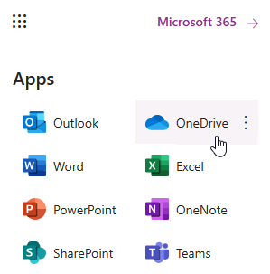
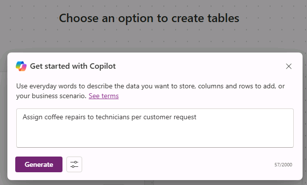

---
lab:
  title: 'ラボ 1:データからキャンバス アプリを作成する'
  module: 'Module 1: Get started with Power Apps canvas apps'
---

# 実習ラボ 1 - データからキャンバス アプリを作成する

このラボでは、既存のデータ ソースからキャンバス アプリを設計し、ビルドします。

## 学習する内容

- CoPilot を使ってデータから Power Apps キャンバス アプリを作成する方法
- OneDrive for Business をデータ ソースとして使って Excel に接続する方法

## ラボ手順の概要

- データからキャンバス アプリを作成する
- アプリをテストする
- CoPilot を使ってキャンバス アプリを作成する
  
## 前提条件

- 以下を完了している必要があります: 「**ラボ 0: ラボ環境を検証する**」

## 詳細な手順

## 演習 1 - データを取得する

### タスク 1.1 - Excel スプレッドシートをダウンロードする

1. Web ブラウザーで [CoffeeMachineData.xlsx](https://github.com/MicrosoftLearning/PL-7001-Create-and-manage-canvas-apps-with-Power-Apps/blob/master/Allfiles/Labs/CoffeeMachineData.xlsx) (`https://github.com/MicrosoftLearning/PL-7001-Create-and-manage-canvas-apps-with-Power-Apps/blob/master/Allfiles/Labs/CoffeeMachineData.xlsx`) に移動します。

1. **[Raw]** ファイル ボタンを選び、Excel ブックをダウンロードします。

    ![GitHub の [Raw] ダウンロード アイコンのスクリーンショット。](../media/raw-download.png)

### タスク 1.2 OneDrive for Business にアップロードする

1. [Power Apps Maker ポータル](https://make.powerapps.com)で、ブラウザー ウィンドウの左上にある**アプリ起動ツール**を選び、**[OneDrive]** を選びます。

    

1. ポップアップが表示されたら、**[OneDrive の準備ができました]** を選びます。

1. **[+ 作成またはアップロード]**、**[ファイルのアップロード]** の順に選択します。

    

1. **ダウンロード** フォルダーを参照し、**CoffeeMachineData.xlsx** ファイルを選択して、**[開く]** を選択します。

1. **[マイ ファイル]** を選び、CoffeeMachineData.xlsx がアップロードされていることを確認します。

## 演習 2 - データからキャンバス アプリを構築する

### タスク 2.1 - アプリを作成する

1. Power Apps Maker ポータル <https://make.powerapps.com> に移動します。

1. **Dev One** 環境内にいることを確認します。

1. 左側のメニューから **[+ 作成]** タブを選択します。

1. **[アプリの作成]** で **[データから開始]** タイルを選択します。

    ![[データから開始] タイルのスクリーンショット。](../media/start-with-data.png)

1. **[その他の開始方法]** で **[外部データの接続]** タイルを選択します。

    ![[外部データの接続] タイルのスクリーンショット。](../media/connect-external-data.png)

1. **[データ セットを選択して開始します]** で **[Excel から]** タイルを選択します。

    ![[Excel から開始] タイルのスクリーンショット。](../media/from-excel.png)

1. 少し遅れて、**Excel Online (Business)** 接続が自動的に作成されます。

1. **[テーブルの選択]** で **[OneDrive for Business]** を展開します。

1. **[OneDrive]** を展開します。

1. **CoffeeMachineData.xlsx** Excel ファイルを展開します。

1. **CoffeeMachines** テーブルを選択します。

    

1. **[Create app](アプリの作成)** を選択します。

1. **[Power Apps Studio へようこそ]** ポップアップ ダイアログが表示されたら、**[今後このメッセージを表示しない]** を選び、**[スキップする]** を選びます。

1. アプリが作成されるまで待ちます。

    

1. Power Apps Studio の右上にある **[保存]** を選び、「`Coffee Machines App`」と入力して、**[保存]** を選びます。

### タスク 2.2 - アプリをテストする

1. Power Apps Studio の右上にある **[アプリのプレビュー]** アイコンを選択します (または F5 キーを押します)。

1. ギャラリー内の任意のマシンを選びます。 これにより、コンピューターの詳細がフォームに表示されます。

1. アプリの右上にある **[編集]** アイコンを選びます。

1. **[Machine Price]** を変更し、アプリの右上にある**チェックマーク** アイコンを選択します。

1. アプリの左上にある **[+ 新規]** アイコンを選択します。

1. [Machine ID] に「`abcde`」と入力します。

1. **[Machine Name]** に「`Demo Machine`」と入力します。

1. **[Machine Price]** に「`999`」と入力します。

1. アプリの右上にある**チェックマーク** アイコンを選択します。

1. 右上にある **[X]** を選んでプレビューを停止します。

1. **[ご存知でしたか?]** ポップアップ ダイアログが表示されたら、**[今後このメッセージを表示しない]** を選び、**[OK]** 選びます。

1. コマンド バーの左上にある **[戻る]** ボタン、**[終了]** の順に選択し、アプリを終了してください。

## 演習 3 - Copilot を使ってキャンバス アプリをビルドする

### タスク 3.1 - アプリを作成する

1. Power Apps 作成者ポータル (`https://make.powerapps.com`) に移動します

1. **Dev One** 環境にいることを確認します。

1. 左側のメニューから **[+ 作成]** タブを選択します。

1. **[アプリの作成]** で **[Copilot で開始]** タイルを選択します。

1. **[Copilot を使用する]** で「`Assign coffee repairs to technicians per customer request`」と入力します。

    

1. **[テーブル オプション]** アイコンを選択し、**[1 つのテーブル]** を選択します。

    

1. **[Generate] \(生成)** を選択します。

    Copilot は、アプリケーションをサポートするためのテーブル構造の構築を開始します。

    > **重要:** 生成 AI を使用する場合、常に同じ正確な結果が得られるとは限りません。 自分のテーブルが別の学生用に作成されたテーブルと完全に一致しないということはあり得ます。

1. テーブルの横にある **[...]** を選択し、**[データの表示]** を選択します。

    

1. 表を確認する

    

1. テーブルが適切であれば、**[Save and open app]** ボタンを選択します。

1. 必要に応じて、**[Done working?]** 画面で、**[Don’t ask me again]** を選択し、**[Save and open app]** ボタンを選択します。

1. アプリが作成されるまで待ちます。

    

1. Power Apps Studio の右上にある **[保存]** を選び、「`Coffee Machine Repairs App`」と入力して、**[保存]** を選びます。

1. コマンド バーの左上にある **[<- 戻る]** ボタンを選び、**[終了]** を選んでアプリを終了します。

1. Power Apps メーカー ポータルの左側のメニューから **[アプリ]** タブを選びます。
