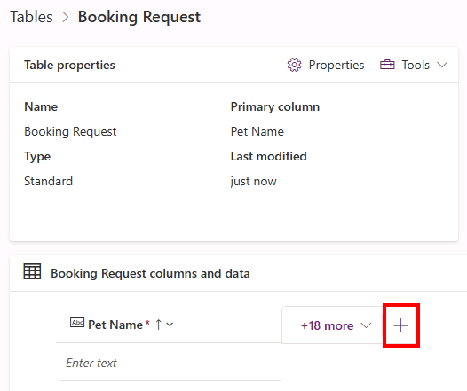
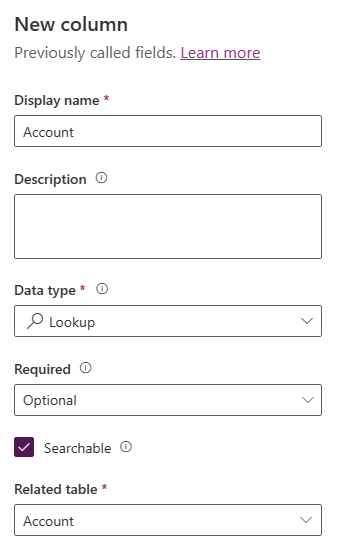

---
lab:
  title: 'ラボ 2:データ モデル'
  module: 'Module 2: Get started with Microsoft Dataverse'
---

# 実習ラボ 2 - データ モデル

このラボでは、Dataverse のテーブルと列を作成します。

## 学習する内容

- Microsoft Dataverse でテーブルと列を作成する方法
- 検索列を使ってリレーションシップを作成する方法

## ラボ手順の概要

- カスタム テーブルを作成する
- テーブルに列を追加する
- 検索列を使ってリレーションシップを作成する
  
## 前提条件

- 以下を完了している必要があります: 「**ラボ 0: ラボ環境を検証する**」

## 詳細な手順

## 演習 1 - カスタム テーブルを作成する

### タスク 1.1 - Booking Request テーブルを作成する

1. Power Apps 作成者ポータル (`https://make.powerapps.com`) に移動します

1. **Dev One** 環境にいることを確認します。

1. 左側のナビゲーション ウィンドウで、**テーブル**を選択します。

1. **[+ 新しいテーブル]** を選び、**[列とデータの追加]** を選びます。

    

1. **[新しいテーブル]** の横にある **[テーブル プロパティの編集]** 鉛筆アイコンを選択します。

    

1. **[表示名]** に `Booking Request` を入力します。

1. **[保存]** を選択します。

### タスク 1.2 - プライマリ列

1. **[新しい列]** の横にあるドロップダウン キャレットを選び、**[列の編集]** を選びます。

    

1. **[表示名]** に `Pet Name` を入力します。

1. **[更新]** を選択します。

1. **［作成］** を選択します

### タスク 1.3 - 列を追加する

1. **[Booking Request columns and data]\(Booking Request の列およびデータ\)** ペインで、**+** を選んで新しい列を追加します。

    

1. **[新しい列]** ペインで、次の値を入力するか選びます。

   1. 表示名: `Owner Name`
   1. データ型:**1 行のテキスト**
   1. 必須:**業務上必須**

    

1. **[保存]** を選択します。

1. **[Booking Request columns and data]\(Booking Request の列およびデータ\)** ペインで、**+** を選んで新しい列を追加します。

1. **[新しい列]** ペインで、次の値を入力するか選びます。

   1. 表示名: `Owner Email`
   1. データ型:**1 行のテキスト**
   1. 形式:**電子メール**
   1. 必須:**業務上必須**

1. **[保存]** を選択します。

1. **[Booking Request columns and data]\(Booking Request の列およびデータ\)** ペインで **+** を選び、**[新しい列]** ペインで次の値を入力するか選びます。

   1. 表示名: `Start Date`
   1. データ型:**日付と時刻**
   1. 必須:**業務上必須**

1. **[保存]** を選択します。

1. **[Booking Request columns and data]\(Booking Request の列およびデータ\)** ペインで **+** を選び、**[新しい列]** ペインで次の値を入力するか選びます。

   1. 表示名: `End Date`
   1. データ型:**日付と時刻**
   1. 必須:**省略可能**

1. **[保存]** を選択します。

1. **[Booking Request columns and data]\(Booking Request の列およびデータ\)** ペインで **+** を選び、**[新しい列]** ペインで次の値を入力するか選びます。

   1. 表示名: `Cost`
   1. データ型:"**通貨**"
   1. 必須:**省略可能**

1. **[保存]** を選択します。

1. **[Booking Request columns and data]\(Booking Request の列およびデータ\)** ペインで **+** を選び、**[新しい列]** ペインで次の値を入力するか選びます。

   1. 表示名: `Notes`
   1. データ型:**複数行のテキスト**
   1. 形式:**Text**
   1. 必須:**省略可能**

1. **[保存]** を選択します。

### タスク 1.4 - 選択肢列を追加する

1. **[Booking Request columns and data]\(Booking Request の列およびデータ\)** ペインで **+** を選び、**[新しい列]** ペインで次の値を入力するか選びます。

   1. 表示名: `Decision`
   1. データ型:**選択肢**
   1. 必須:**省略可能**

1. **[グローバルな選択肢と同期しますか?]** で **[いいえ]** を選びます

1. **[ラベル]** に「`Undecided`」と入力し、**[値]** に「`1`」と入力します。

1. **[+ 新しい選択肢]** を選び、**[ラベル]** に「`Accepted`」と入力し、**[値]** に「`2`」と入力します。

1. **[+ 新しい選択肢]** を選び、**[ラベル]** に「`Declined`」と入力し、**[値]** に「`3`」と入力します。

1. **[既定の選択肢]** で **[Undecided]\(未決定\)** を選びます。

    

1. **[保存]** を選択します。

## 演習 2 - リレーションシップを作成する

### タスク 2.1 - 検索列を作成する

1. Power Apps 作成者ポータル (`https://make.powerapps.com`) に移動します

1. **Dev One** 環境にいることを確認します。

1. 左側のナビゲーション ウィンドウで、**テーブル**を選択します。

1. **Booking Request** を選びます。

1. **[Booking Request columns and data]\(Booking Request の列およびデータ\)** ペインで **+** を選び、**[新しい列]** ペインで次の値を入力するか選びます。

   1. 表示名: `Account`
   1. データ型:**Lookup**
   1. 必須:**省略可能**
   1. 関連テーブル:**アカウント**

    

1. **[保存]** を選択します。

## 演習 3 - データ

### タスク 3.1 - 予約要求レコードを追加する

1. Power Apps Maker ポータル <https://make.powerapps.com> に移動します。

1. **Dev One** 環境にいることを確認します。

1. 左側のナビゲーション ウィンドウで、**テーブル**を選択します。

1. **Booking Request** を選びます。

1. **[Booking Request columns and data] (Booking Request の列とデータ)** ペインで、**[編集]** の横にあるドロップダウン キャレットを選び、**[Edit in new tab] (新しいタブで編集)** を選びます。

1. 以下の値を入力または選択します。

   1. ペットの名前: `Fido`
   1. Owner Name: `MOD Administrator`
   1. 所有者のメール アドレス:自分のテナントのメール アドレスを使います
   1. 開始日:**明日**
   1. 終了日:**次の週の日付を選びます**
   1. コスト: `1,000`
   1. 決めること:**受け付け済み**

1. **[下に行を挿入]** を選択し、以下の値を入力するか選択します。

   1. ペットの名前: `Tom`
   1. Owner Name: `MOD Administrator`
   1. 所有者のメール アドレス:自分のテナントのメール アドレスを使います
   1. 開始日:**次の月の日付を選びます**
   1. 終了日:**開始日より後の日付を選びます**
   1. コスト: `1,500`
   1. 決めること:**未決定**

1. **[下に行を挿入]** を選択し、以下の値を入力するか選択します。

   1. ペットの名前: `Jim`
   1. Owner Name: `MOD Administrator`
   1. 所有者のメール アドレス:自分のテナントのメール アドレスを使います
   1. 開始日:**現在の月の将来の日付を選択する**
   1. 終了日:**開始日より後の日付を選びます**
   1. コスト: `250`
   1. 決めること:**拒否済み**

1. [データの編集] タブを閉じます。

