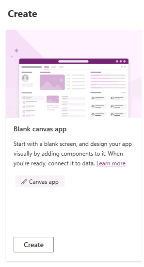
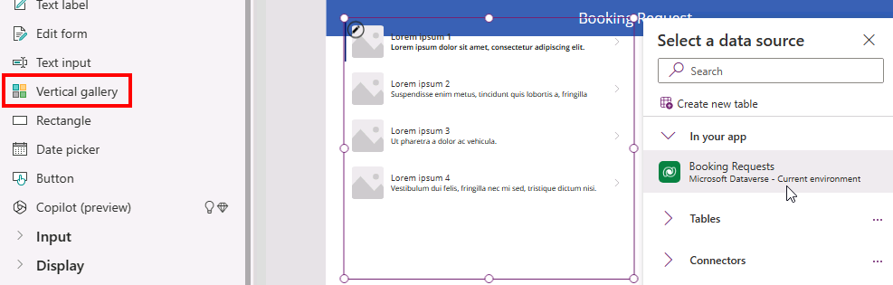

---
lab:
  title: '課題 3:キャンバス アプリケーションを作成する'
  module: 'Module 3: Customize a canvas app in Power Apps'
---

# 演習ラボ 3 – キャンバス アプリを作成する

このラボでは、何もないところからキャンバス アプリを設計して構築し、データ ソースとギャラリーを追加します。

## 学習する内容

- データ ソースにリンクされたギャラリーを使用してキャンバス アプリを作成する方法
- Power Fx 数式を使用してフィールドをフォーマットする方法

## ラボ手順の概要

- キャンバス アプリを一から作成する
- アプリにデータ ソースを追加する
- アプリにギャラリーを追加する
- ギャラリー内のフィールドを構成する
  
## 前提条件

- 以下を完了している必要があります。「**ラボ 2: データ モデル**」

## 詳細な手順

## 演習 1 - キャンバス アプリを作成する

### タスク 1.1 - アプリを作成する

1. Power Apps Maker ポータル <https://make.powerapps.com> に移動します。

1. **Dev One** 環境内にいることを確認します。

1. 左側のメニューから **[+ 作成]** タブを選択します。

1. **[開始]** の下にある **[空のアプリ]** タイルを選択します。

    

1. **[空のキャンバス アプリ]** タイルの下にある **[作成]** を選択します。

1. **[アプリ名]** には `Booking Request app` を入力します。

1. **[形式]** では **[タブレット]** を選択します。

    

1. **［作成］** を選択します

1. アプリが構築されるのを待ちます。

1. Power Apps Studio の右上にある **[保存]** を選択します。

### タスク 1.2 - データ ソースを追加する

1. アプリの作成メニューで **データ** を選択します。

    ![[データ] ペインのスクリーンショット。](../media/studio-data-pane.png)

1. **[データの追加]** の横にあるドロップダウン キャレットを選択し、**[検索]** に `Booking` と入力します。

    

1. **[Booking Requests]** Microsoft Dataverse テーブルを選択します。

### タスク 1.3 - メイン画面を構成する

1. アプリの作成メニューで、**[ツリー ビュー]** を選択します。

1. ツリー ビューで **[Screen1]** を選択し、省略記号 (**[...]**) を選択し、**[名前の変更]** を選択してください。

1. 「`MainScreen`」と入力します。

1. アプリの作成メニューで、**[挿入 (+)]** を選択します。

1. **[四角形]** を選択します。

1. 四角形を画面の左上にドラッグします。

1. アプリの作成メニューで、**[ツリー ビュー]** を選択します。

1. 四角形の名前を `HeaderRect` に変更します。

1. 数式バーで四角形のプロパティを次のように設定してください。

   1. X=`0`
   1. Y=`0`
   1. 高さ=`80`
   1. 幅=`Parent.Width`

1. アプリの作成メニューで、**[挿入 (+)]** を選択します。

1. **テキスト ラベル**を選択します。

1. ラベルを画面の左上にドラッグします。

1. アプリの作成メニューで、**[ツリー ビュー]** を選択します。

1. ラベルの名前を `HeaderLabel` に変更します。

1. 数式バーでラベルのプロパティを以下のように設定してください。

   1. X=`0`
   1. Y=`0`
   1. 高さ=`80`
   1. 幅=`Parent.Width`
   1. 配置=`Align.Center`
   1. サイズ=`24`
   1. テキスト=`"Booking Request"`
   1. 色=`Color.White`

    

1. Power Apps Studio の右上にある **[保存]** を選択します。

### タスク 1.4 - ギャラリーを追加する

1. アプリの作成メニューで、**[挿入 (+)]** を選択します。

1. **垂直ギャラリー**を選択します。

    

1. データ ソースの **[予約要求]** を選択してください。

    

1. **[レイアウト]** で **[タイトル、サブタイトル、本文]** を選択します。

1. **[フィールド]** の横にある **[7 件選択済み]** を選択します

1. **[本文]** で **[コスト]** を選択します。

1. **[サブタイトル]** で **[決定]** を選択します。

1. **[タイトル]** で **[ペットの名前]** を選択します。

    

1. データ ウィンドウを閉じます。

1. アプリの作成メニューで、**[ツリー ビュー]** を選択します。

1. ギャラリーの名前を `BookingRequestList` に変更します。

1. 数式バーでギャラリーのプロパティを次のように設定してください。

   1. X=`0`
   1. Y=`80`
   1. 高さ=`575`
   1. 幅=`250`

### タスク 1.5 - 通貨フィールドをフォーマットする

1. アプリの作成メニューで、**[ツリー ビュー]** を選択します。

1. ギャラリーを展開します。

1. 本文を選択します。

    

1. 数式バーの **Text** プロパティを数式に設定してください。

    ```powerappsfl
    Text(Value(ThisItem.Cost), "$#,##0.00")
    ```

1. Power Apps Studio の右上にある **[保存]** を選択します。

1. コマンド バーの左上にある **[<- 戻る]** ボタン、**[終了]** の順に選択し、アプリを終了します。
