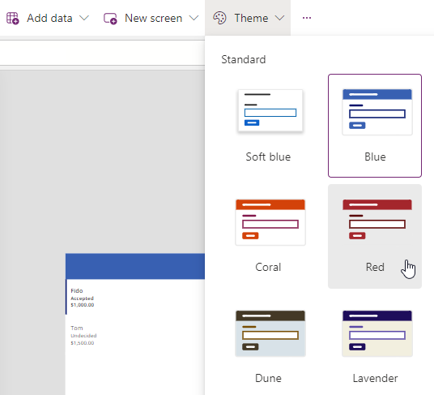

---
lab:
  title: 'ラボ 4:UI をビルドする'
  module: 'Module 4: How to build the UI in a canvas app in Power Apps'
---

# 実習ラボ 4 – UI を構築する

このラボでは、アプリのコントロールの色を変更します。

## 学習する内容

- テーマの使用方法
- アプリをカスタマイズする方法

## ラボ手順の概要

- テーマを選択する
- パーソナル化
  
## 前提条件

- 「**ラボ 3: キャンバス アプリを作成する**」を完了している必要があります

## 詳細な手順

## 演習 1 – テーマ

### タスク 1.1 - アプリを編集する

1. Power Apps Maker ポータル <https://make.powerapps.com> に移動します。

1. **Dev One** 環境にいることを確認します。

1. 左側のメニューから **[アプリ]** タブを選択します。

1. **[予約要求アプリ]** を選択し、コマンド (**...**) を選んで、**[編集] > [新しいタブで編集]** を選択します。

### タスク 1.2 - テーマを選択する

1. Power Apps Studio のアクション バーで、**[テーマ]** を選択します。

    

1. **[赤]** のテーマを選択します。

### タスク 1.3 - ブランド コントロール

1. アプリの作成メニューで、**[ツリー ビュー]** を選択します。

1. ギャラリーを展開します。

1. **[NextArrow]** を選択します。

1. NextArrow の **[Color]** プロパティを次の値に設定します。

    ```powerappsfl
    RGBA(164, 38, 44, 1)
    ```

1. **Body** を選択します。

1. 本文の **[Color]** プロパティを次の値に設定します。

    ```powerappsfl
    If(ThisItem.Cost > 1000, RGBA(164, 38, 44, 1), Color.Black)
    ```

1. Power Apps Studio の右上にある **[保存]** を選択します。

## 演習 2 – パーソナル化

### タスク 2.1 - ユーザー ラベルを追加する

1. 空のキャンバスでギャラリーの外側をクリックします。

1. アプリの作成メニューで、**[挿入 (+)]** を選択します。

1. **テキスト ラベル**を選択します。

1. 画面の右上にラベルをドラッグします。

1. アプリの作成メニューで、**[ツリー ビュー]** を選択します。

1. ラベルの名前を `UserLabel` に変更します。

1. ラベルのプロパティを次のように設定します。

   1. X=`1100`
   1. Y=`20`
   1. Height=`40`
   1. Width=`250`
   1. Align=`Align.Right`
   1. Size=`18`
   1. PaddingRight=`10`
   1. Color=`Color.White`
   1. Text=`User().FullName`

    

1. Power Apps Studio の右上にある **[保存]** を選択します。

1. コマンド バーの左上にある **[<- 戻る]** ボタンを選択し、**[終了]** を選んでアプリを終了します。
