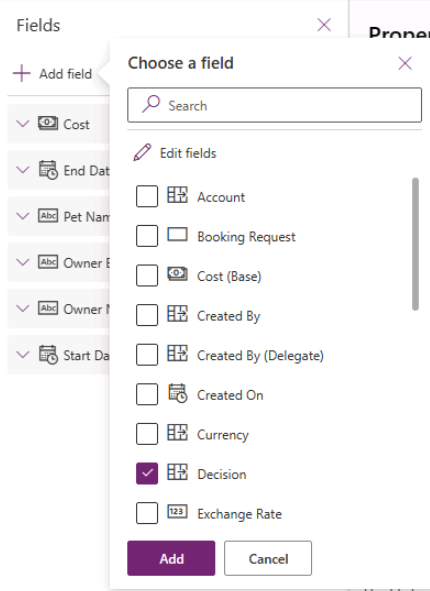

---
lab:
  title: 'ラボ 6:フォーム'
  module: 'Module 6: Write data in a Power Apps canvas app'
---

# 実習ラボ 6 - フォーム

このラボでは、フォームを使用してデータ ソースでレコードを作成し編集します。

## 学習する内容

- 画面を追加する方法
- スクリプト間を移動する方法
- フォームを使用してデータ ソースでレコードを作成する方法
- フォームを使用してデータ ソースでレコードを編集する方法
- データ ソースからレコードを削除する方法
- フォームをギャラリーにリンクする方法

## ラボ手順の概要

- 新しい画面を作成する
- ギャラリーでレコードが選択されているときに画面に移動する
- スクリプト間を移動する
- フォームを使用してレコードを表示する
- レコードを削除する
- フォームを使用してレコードを編集する
- フォームを使用して新しいレコードを作成する
  
## 前提条件

- 以下を完了している必要があります: 「**ラボ 5: 外部データ**」

## 詳細な手順

## 演習 1 – 画面とナビゲーションを追加する

### タスク 1.1 - アプリを編集する

1. Power Apps Maker ポータル <https://make.powerapps.com> に移動します。

1. **Dev One** 環境にいることを確認します。

1. 左側のメニューから **[アプリ]** タブを選択します。

1. **[予約要求アプリ]**、コマンド (**...**)、**[編集] > [新しいタブで編集]** の順に選択します。

### タスク 1.2 - 画面を追加する

1. アプリの作成メニューで、**[ツリー ビュー]** を選択します。

1. Power Apps Studio のアクション バーで、**[新しい画面]** を選択します。

    

1. **空白**を選択します。

1. 画面の名前を `EditScreen` に変更します。

1. Power Apps Studio のアクション バーで、**[新しい画面]** を選択します。

1. **[ヘッダーとフッター]** を選択します。

1. 画面の名前を `DetailScreen` に変更します。

### タスク 1.3 - ナビゲーションを追加する

1. **[MainScreen]** の **[BookingRequestList]** で **[NextArrow]** を選択します。

1. [NextArrow] の **OnSelect** プロパティを次の値に設定します。

    ```powerappsfl
    Collect(colRequests, ThisItem);Navigate(DetailScreen, ScreenTransition.Cover);
    ```

1. **[EditScreen]** を選択します。

1. アプリの作成メニューで、**[挿入 (+)]** を選択します。

1. **[Icons]** を展開します。

1. **戻る矢印**を選択します。

1. アイコンの **OnSelect** プロパティを次の値に設定します。

    ```powerappsfl
    Back()
    ```

1. **ツリー ビュー**でアイコン、コマンド (**...**)、**[コピー]** の順に選択します。

1. **[DetailScreen]** を展開します。

1. **[HeaderContainer]**、コマンド (**...**)、**[貼り付け]** の順に選択します。

## 演習 2 – 詳細画面

### タスク 2.1 - 表示フォームを追加する

1. アプリの作成メニューで、**[ツリー ビュー]** を選択します。

1. **[DetailScreen]** を展開します。

1. **[ScreenContainer]** を展開ます。

1. **[MainContainer]** を選択します。

1. アプリの作成メニューで、**[挿入 (+)]** を選択します。

1. **[入力]** を展開します。

1. **[表示フォーム]** を選択します。

    

1. FormViewer のプロパティで、**[データ ソース]** の **[予約要求]** を選択します。

1. **[フィールド]** の横にある **[2 件選択済み]** を選択します。

    

1. フィールドの横にある省略記号 (**...**)、**[削除]** の順に選択し、**[作成日]** を削除します。

1. **[+ フィールドの追加]** を選択し、次のフィールドを選択します。

   1. コスト
   1. Decision
   1. 終了日
   1. 所有者のメール
   1. 所有者名
   1. 開始日

    

1. **[追加]** を選択します。

1. 次のフィールドを次の順序にドラッグします。

   1. ペットの名前
   1. 所有者名
   1. 所有者のメール
   1. 開始日
   1. 終了日
   1. Decision
   1. コスト

    

1. **[フィールド]** ペインを**閉じます**。

1. フォーム ビューアー コントロールの **Item** プロパティを次の値に設定します。

    ```powerappsfl
    BookingRequestList.Selected
    ```

### タスク 2.2 - ラベルを追加する

1. アプリの作成メニューで、**[ツリー ビュー]** を選択します。

1. **[DetailScreen]** を展開します。

1. **[ScreenContainer]** を展開ます。

1. **[FooterContainer]** を選択します。

1. フッター コンテナー内で **+** を選択します。

    

1. **[テキスト ラベル]** を選択します

1. ラベルの **Text** プロパティを次の値に設定します。

    ```powerappsfl
    BookingRequestList.Selected.'Pet Name'
    ```

### タスク 2.3 - 削除ボタンを追加する

1. アプリの作成メニューで、**[ツリー ビュー]** を選択します。

1. **[DetailScreen]** を展開します。

1. **[ScreenContainer]** を展開ます。

1. **[FooterContainer]** を選択します。

1. アプリの作成メニューで、**[挿入 (+)]** を選択します。

1. **ボタン** を選択します。

1. アプリの作成メニューで、**[ツリー ビュー]** を選択します。

1. ボタンの名前を `Deletebtn` に変更します。

1. ボタンの **Text** プロパティを次の値に設定します。

    ```powerappsfl
    "Delete"
    ```

1. ボタンの **OnSelect** プロパティを次のように設定します。

    ```powerappsfl
    Remove('Booking Requests', BookingRequestList.Selected); Back();
    ```

## 演習 3 - 編集画面

### タスク 3.1 - 編集フォームを追加する

1. アプリの作成メニューで、**[ツリー ビュー]** を選択します。

1. **[EditScreen]** を選択します。

1. アプリの作成メニューで、**[挿入 (+)]** を選択します。

1. **[編集フォーム]** を選択します。

1. フォームのプロパティで、**[データ ソース]** の **[予約要求]** を選択します。

1. **[フィールド]** の横にある **[2 件選択済み]** を選択します。

1. フィールドの横にある省略記号 (**...**)、**[削除]** の順に選択し、**[作成日]** を削除します。

1. **[+ フィールドの追加]** を選択し、次のフィールドを選択します。

   1. コスト
   1. 終了日
   1. 所有者のメール
   1. 所有者名
   1. 開始日

1. **[追加]** を選択します。

1. 次のフィールドを次の順序にドラッグします。

   1. ペットの名前
   1. 所有者名
   1. 所有者のメール
   1. 開始日
   1. 終了日
   1. コスト

1. **[フィールド]** ペインを**閉じます**。

1. フォーム コントロールの **Item** プロパティを次の値に設定します。

    ```powerappsfl
    BookingRequestList.Selected
    ```

1. アプリの作成メニューで、**[ツリー ビュー]** を選択します。

1. フォームの名前を `BookingRequestForm` に変更します。

1. フォームのプロパティを次のように設定します。

   1. X = `0`
   1. Y = `125`
   1. Height = `500`
   1. Width = `Parent.Width`
   1. Columns = `1`
   1. Layout = `Horizontal`

    

### タスク 3.2 - 送信ボタンを追加する

1. アプリの作成メニューで、**[ツリー ビュー]** を選択します。

1. **[EditScreen]** を選択します。

1. アプリの作成メニューで、**[挿入 (+)]** を選択します。

1. **ボタン** を選択します。

1. ボタンをフォームの下にドラッグします。

1. アプリの作成メニューで、**[ツリー ビュー]** を選択します。

1. ボタンの名前を `Submitbtn` に変更します。

1. ボタンの **Text** プロパティを次の値に設定します。

    ```powerappsfl
    "Submit"
    ```

1. ボタンの **OnSelect** プロパティを次のように設定します。

    ```powerappsfl
    SubmitForm(BookingRequestForm)
    ```

1. **[BookingRequestForm]** を選択します。

1. ボタンの **OnSuccess** プロパティを次の値に設定します。

    ```powerappsfl
    Navigate(MainScreen, ScreenTransition.UnCover)
    ```

### タスク 3.3 - 編集画面にナビゲーションを追加する

1. アプリの作成メニューで、**[ツリー ビュー]** を選択します。

1. **[DetailScreen]** を展開します。

1. **[ScreenContainer]** を展開ます。

1. **[HeaderContainer]** を選択します。

1. アプリの作成メニューで、**[挿入 (+)]** を選択します。

1. **[Icons]** を展開します。

1. **編集**を選択します。

1. アプリの作成メニューで、**[ツリー ビュー]** を選択します。

1. アイコンの名前を `EditIcon` に変更します。

1. アイコンの **OnSelect** プロパティを次の値に設定します。

    ```powerappsfl
    Navigate(EditScreen, ScreenTransition.Cover)
    ```

### タスク 3.4 - 新しいレコード

1. アプリの作成メニューで、**[ツリー ビュー]** を選択します。

1. **[MainScreen]** を選択します。

1. アプリの作成メニューで、**[挿入 (+)]** を選択します。

1. **[Icons]** を展開します。

1. **[追加]** を選択します。

1. アプリの作成メニューで、**[ツリー ビュー]** を選択します。

1. アイコンの名前を `NewIcon` に変更します。

1. アイコンのプロパティを次のように設定します。

   1. X = `0`
   1. Y = `0`
   1. Height = `80`
   1. Width = `80`
   1. Color = `Color.White`

1. アイコンの **OnSelect** プロパティを次の値に設定します。

    ```powerappsfl
    NewForm(BookingRequestForm);Navigate(EditScreen, ScreenTransition.Cover)
    ```

1. Power Apps Studio の右上にある **[保存]** を選択します。

1. コマンド バーの左上にある **[<- 戻る]** ボタン、**[終了]** の順に選択し、アプリを終了します。
