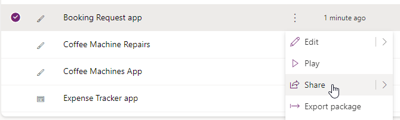
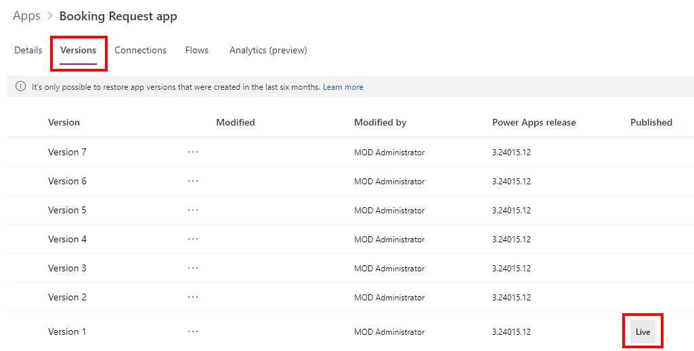

---
lab:
  title: 'ラボ 7:キャンバス アプリを管理する'
  module: 'Module 7: Publish, share, and maintain a canvas app'
  description: このラボでは、キャンバス アプリを管理します。
  duration: 10 minutes
  level: 100
  islab: true
---

# 演習ラボ 7 – キャンバス アプリを管理する

このラボでは、キャンバス アプリを管理します。

## 学習する内容

- キャンバス アプリを共有する方法
- キャンバス アプリのバージョンを管理する方法
- キャンバス アプリを公開する方法
- キャンバス アプリをエクスポートする方法

## ラボ手順の概要

- キャンバス アプリを共有する
- キャンバス アプリのバージョンを表示する
- キャンバス アプリを公開する
- キャンバス アプリをエクスポートする
  
## 前提条件

- 以下を完了している必要があります: 「**ラボ 6:フォーム**

## 詳細な手順

## 演習 1 – 管理

### タスク 1.1 - 予約要求アプリを共有する

1. Power Apps 作成者ポータル (`https://make.powerapps.com`) に移動します

1. **Dev One** 環境にいることを確認します。

1. 左側のナビゲーション メニューから **[アプリ]** タブを選択します。

1. **[予約要求アプリ]** を選択し、[コマンド] (**...**) を選択し、**[共有]** を選択してください。

    

1. **[共有]** ダイアログで、「`Everyone`」と入力し、**[Contoso の全員]** を選択します。

    ![[アプリの共有] ペインのスクリーンショット。](../media/share-app-dialog.png)

1. **[共有]** を選択します。

1. **[共有]** ダイアログで **[閉じる]** を選択します。

### タスク 1.2 - 予約要求アプリを公開する

1. **[予約要求アプリ]** を選択し、[コマンド] (**...**) を選択して、**[詳細]** を選択してください。

1. **バージョン** タブを選択します。

    

1. 最上位バージョンを選択し、**[このバージョンを公開する]** を選択します。

    

1. **[このバージョンを公開する]** を選択して確認します。

## 演習 2 – エクスポート

### タスク 2.1 - 予約要求アプリをエクスポートする

1. Power Apps 作成者ポータル (`https://make.powerapps.com`) に移動します

1. **Dev One** 環境にいることを確認します。

1. 左側のナビゲーション メニューから **[アプリ]** タブを選択します。

1. **[予約要求アプリ]** を選択し、[コマンド] (**...**) を選択して、**[パッケージのエクスポート]** を選択してください。

1. **[名前]** に「`Booking Request app`」と入力します。

1. **[インポートの設定]** で **[更新]** を選択します。

1. **[新しく作成する]** を選択し、**[保存]** を選択してください。

    ![[アプリのエクスポート] ページのスクリーンショット。](../media/export-package.png)

1. **エクスポート**を選択します。

1. パッケージが作成されてダウンロードされるまで待ってください。 これにより、**[ダウンロード]** フォルダーに ZIP ファイルが作成されます。

### タスク 2.2 - アプリをローカルに保存する

1. 左側のナビゲーション メニューから **[アプリ]** タブを選択します。

1. **[予約要求アプリ]** を選択し、コマンド (**...**) を選択して **[編集] > [新しいタブで編集]** の順に選択してください。

1. Power Apps Studio の右上にある **[保存]** の横にあるドロップダウン キャレットを選びます。

1. **[コピーのダウンロード]** を選択してください。

1. **[Download]** を選択します。  これにより、**[ダウンロード]** フォルダーに .msapp ファイルが作成されます。

1. **[保存]** を選択します。

1. コマンド バーの左上にある **[戻る]** ボタン、**[終了]** の順に選択し、アプリを終了してください。
